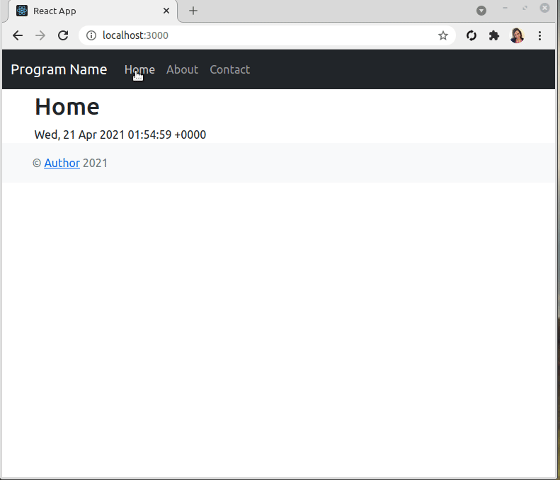

Python Bootstrap Flask React Starter Template
===

A quick and easy Python + Flask + [React](https://reactjs.org) template project, using Twitter [Bootstrap](https://getbootstrap.com) 5.0 and React Router for creating a simple single page application.



## Usage

- Clone repository.
- Open a command prompt, navigate to the folder, and enter: `npm install`
- Next, run a build of the React client by entering: `npm run dev`

### Development Usage

You can make changes to the pages in `/src/components` and see them update live.

## Demo:

http://pythonbootstrapper.herokuapp.com

## Contents:

- /src/index.js
- /src/App.js
- /src/components/Header/index.js
- /src/components/Footer/index.js
- /src/components/Home/index.js
- /src/components/About/index.js
- /src/components/Contact/index.js
- /src/components/NotFound/index.js

## Editing Pages:

Edit `/src/components/Home/index.js` to add your content to the Home page. The default contents include:

```js
class Home extends Component {
  render() {
    return (
      <h1>Home</h1>
      <div>{this.state.time}</div>
    )
  }
}
```

## Author
Kory Becker http://www.primaryobjects.com/kory-becker